# 🤖🎥🕵️‍♂️: PARSEC

### Parallel Agents for Rapid Scene & Evidentiary Context

> **Task-parallelized multi-agent crime-scene reconstruction system**  
> One case → dozens of specialized AI agents running concurrently → auditable pre-vis + provenance in <60 seconds.

> [!WARNING]
> **ALL OUTPUTS ARE AI-GENERATED SIMULATIONS FOR TRAINING & INTERNAL HYPOTHESIS DEVELOPMENT ONLY — NOT EVIDENCE**

A multi-agent system for generating educational crime reconstruction videos from police blotter text or radio logs using parallel AI processing.

### ❗ For Pre-vis purposes only
---

## 📁 Project Structure

```
parallel_agents/
├── parallel_test1.py      # 🏆 Main system - Full multi-agent pipeline with LangGraph
├── als/                   # 🧪 Advanced Load Simulation layer
│   ├── core/              # Deterministic simulation primitives
│   ├── fire/              # Grid-based fire spread model (v1)
│   ├── flood/             # Flood/load overstress model (v1)
│   └── exporter/          # Three.js JSON exporters
├── als_demo_export.py     # 🔁 Generates demo ALS JSON artifacts
├── tests/
│   └── test_als_models.py # ✅ Minimal ALS model/schema tests
├── blotter_reconstructor.py   # 📻 Simpler version - YouTube audio → Video
├── parallel_test0.py      # 📚 Reference - Basic async parallel pattern
├── video_gen.md           # 📖 Reference - Veo3 API usage example
└── README.md              # 📋 This file
```

---

## 🗂️ File Descriptions

### 1. `parallel_test1.py` — Full Multi-Agent System (Recommended)

**Lines:** ~1175 | **Complexity:** High | **Use Case:** Production-ready crime reconstruction

The flagship implementation featuring a complete LangGraph-orchestrated multi-agent pipeline for transforming police blotter text into educational reconstruction videos.

#### Features

- **10 Specialized AI Agents (including ALS branch):**

| Agent | Purpose |
|-------|---------|
| **Transcript Agent** | Converts police codes (10-codes) into narrative dialogue |
| **Scene Breakdown Agent** | Analyzes transcript and breaks into 3-5 key scenes |
| **Scene Geometry Agent** | Builds normalized scene model with source/confidence fields |
| **Hypothesis Generator Agent** | Produces 2-4 competing event hypotheses |
| **Load Simulation Agent(s)** | Runs deterministic simulation per hypothesis in parallel |
| **Hypothesis Consistency Agent** | Ranks hypothesis plausibility against constraints |
| **Visual Reconstruction Agents** (×3) | Generate multi-angle visual prompts in parallel |
| **Synthesis Agent** | Merges outputs into cohesive video script |
| **Critic Agent** | Reviews for accuracy, sensitivity, and legal compliance |

- **Parallel Processing:** Uses `asyncio` for visual fan-out (×3) and physics hypothesis fan-out
- **ALS Sidecar Summaries:** When hypotheses include impact angle + relative velocity, deterministic load summaries are attached to each hypothesis record
- **Human-in-the-Loop:** 3 mandatory confirmation checkpoints
- **Full Audit Trail:** JSON provenance reports with input/output hashes
- **Legal Compliance:** License acceptance, watermarks, safe filenames

#### Usage

```bash
# Basic usage with blotter text
python parallel_test1.py --blotter "10-4, suspicious vehicle at 123 Main St, plates ABC123"

# From file
python parallel_test1.py --blotter-file incident.txt --output_dir ./videos

# Safe mode (enhanced disclaimers + signed certification)
python parallel_test1.py --safe-mode --blotter "..."

# Uses default test blotter if no input provided
python parallel_test1.py
```

#### CLI Arguments

| Argument | Description | Default |
|----------|-------------|---------|
| `--blotter` | Police blotter text input | Sample blotter |
| `--blotter-file` | Path to file containing blotter text | None |
| `--output_dir` | Directory for output videos | `./videos` |
| `--safe-mode` | Enable enhanced disclaimers and certification | False |

#### Pipeline Flow



```mermaid
flowchart TD
    subgraph Input
        A[Validate Input]
    end

    subgraph Processing
        B[Transcript Agent]
        C[Scene Breakdown Agent]
        SG[Scene Geometry Agent]
        HG[Hypothesis Generator Agent]
        LS[Load Simulation Agent Fan-out]
        HC[Hypothesis Consistency Agent]
        D[Parallel Visual Agents ×3]
        E[Synthesis Agent + Physics Segment]
        F[Critic Agent + Physics Review]
    end

    subgraph Checkpoints
        H1[🔴 Human Checkpoint<br/>Review transcript]
        H2[🔴 Human Checkpoint<br/>Review scenes]
        H3[🔴 Human Checkpoint<br/>Final approval]
    end

    subgraph Output
        G[Veo3 Video Gen<br/>+ Provenance]
    end

    A --> B --> H1 --> C --> H2 --> SG --> HG --> LS --> HC --> D
    D --> E --> F --> H3 --> G

    subgraph D[Parallel Visual Agents ×3]
        direction LR
        V1[Scene 1]
        V2[Scene 2]
        V3[Scene 3]
    end
```

#### Output Files

```
videos/
├── SIMULATION_NOT_EVIDENCE_2025-12-06_143022_Case-GEN-abc123.mp4
└── PROVENANCE_SIMULATION_2025-12-06_GEN-abc123_abc123.json
```

### 1a. `als/` — Advanced Load Simulation Layer

The new `/als` package provides a deterministic physics and environmental simulation abstraction that can evolve independently from the LangGraph orchestration code.

| Module | Purpose |
|--------|---------|
| `als/scene_geometry_agent.py` | Normalizes incident geometry with `source` + `confidence` |
| `als/hypothesis_agent.py` | Generates competing event hypotheses (`H1..H4`) |
| `als/load_simulation_agent.py` | Runs ballistic/load simulation per hypothesis |
| `als/hypothesis_consistency_agent.py` | Ranks simulation outputs and emits best-fit summary |
| `als/fire/fire_model.py` | Grid-based fire spread starter model |
| `als/flood/flood_model.py` | Flood pressure/load-overstress starter model |
| `als/exporter/to_threejs_json.py` | Exports frame payloads for Three.js playback |

#### ALS Demo Artifact Export (canonical Three.js input)

```bash
# Writes:
#   output/als_demo_fire.json
#   output/als_demo_flood.json
# And canonical exports:
#   als_exports/demo-case/fire.json
#   als_exports/demo-case/flood.json
python3 als_demo_export.py
```

#### Locked Three.js JSON Schema (v1)

Top-level envelope produced by `to_threejs_json(...)`:

```json
{
  "schema": "als.threejs.v1",
  "scenario_type": "fire",
  "coordinate_system": "local_meters",
  "metadata": {
    "demo": true,
    "model": "FireSpreadModel"
  },
  "frame_count": 2,
  "frames": [
    {
      "t": 0.0,
      "heat_grid": [[0.0, 0.2], [0.4, 1.0]],
      "damage_grid": [[0.0, 0.0], [0.0, 0.1]],
      "fuel_grid": [[1.0, 0.9], [0.8, 0.7]]
    },
    {
      "t": 1.0,
      "heat_grid": [[0.1, 0.3], [0.5, 0.9]],
      "damage_grid": [[0.0, 0.0], [0.1, 0.2]],
      "fuel_grid": [[0.95, 0.85], [0.75, 0.6]]
    }
  ],
  "warning": "Simulation output is approximate and for educational/internal hypothesis development only. NOT evidentiary."
}
```

Canonical loader path convention for Tronverse / Three.js:

```text
/als_exports/<case_id>/<scenario_type>.json
```

---

### 2. `blotter_reconstructor.py` — YouTube Audio Pipeline

**Lines:** ~453 | **Complexity:** Medium | **Use Case:** Live stream reconstruction

A streamlined single-pipeline tool that captures audio from YouTube live streams (like police scanners), transcribes it with Whisper, and generates reconstruction videos.

#### Features

- **YouTube Integration:** Downloads segments from live streams using `yt-dlp`
- **Whisper Transcription:** Local speech-to-text with OpenAI Whisper
- **Scene Parsing:** Regex-based extraction of police codes, locations, actions
- **Veo3 Generation:** Creates reconstruction video with disclaimers
- **Full Legal Compliance:** Same safeguards as parallel_test1.py

#### Usage

```bash
# Basic usage
python blotter_reconstructor.py --url "https://youtube.com/watch?v=..." --duration 10

# With output directory
python blotter_reconstructor.py --url "..." --duration 5 --output_dir ./videos

# Safe mode
python blotter_reconstructor.py --url "..." --duration 5 --safe-mode
```

#### CLI Arguments

| Argument | Description | Default |
|----------|-------------|---------|
| `--url` | YouTube live stream URL (required) | - |
| `--duration` | Seconds of audio to capture | 2 |
| `--output_dir` | Directory for output videos | `.` |
| `--safe-mode` | Enable enhanced disclaimers | False |

#### Pipeline Flow


---

### 3. `parallel_test0.py` — Basic Async Pattern Reference

**Lines:** 30 | **Complexity:** Low | **Use Case:** Learning/reference

A minimal example demonstrating the core async parallel pattern for batch LLM calls using `asyncio.gather()` with LiteLLM.

#### Key Concepts Demonstrated

```python
# The magic line - runs all tasks concurrently:
results = await asyncio.gather(*[run_task(t) for t in tasks], return_exceptions=True)
```

#### Usage

```bash
python parallel_test0.py
```

#### When to Use

- Learning async patterns
- Testing parallel LLM calls
- Building custom batch processors

---

### 4. `video_gen.md` — Veo3 API Reference

**Lines:** 57 | **Complexity:** Low | **Use Case:** API reference

A working example of the Google Veo3 video generation API. Use this as a reference for the correct API calling pattern.

#### Key Pattern

```python
from google import genai

client = genai.Client()
operation = client.models.generate_videos(
    model="veo-3.0-generate-001",
    prompt="Your prompt here",
)

# Poll until done
while not operation.done:
    time.sleep(10)
    operation = client.operations.get(operation)

# Download result
generated_video = operation.response.generated_videos[0]
client.files.download(file=generated_video.video)
generated_video.video.save("output.mp4")
```

---

## 🔧 Installation

### Prerequisites

```bash
# Core dependencies
pip install langgraph openai google-genai python-dotenv tqdm

# For blotter_reconstructor.py
pip install openai-whisper

# For parallel_test0.py
pip install litellm

# External tool (for YouTube downloads)
# Install yt-dlp: https://github.com/yt-dlp/yt-dlp
```

### Environment Variables

Create a `.env` file:

```env
OPENAI_API_KEY=sk-...
GOOGLE_API_KEY=...  # For Veo3
```

---

## 🛡️ Safety & Compliance Features

All scripts include comprehensive legal safeguards:

| Feature | Description |
|---------|-------------|
| **Legal Banner** | ASCII art warning displayed at startup |
| **License Acceptance** | Must type "I ACCEPT" to proceed |
| **Human Checkpoints** | Confirm at transcript, scenes, and video generation |
| **Safe Filenames** | `SIMULATION_NOT_EVIDENCE_YYYY-MM-DD_...` |
| **Provenance Reports** | JSON sidecar with full audit trail and hashes |
| **Watermark Instructions** | AI prompted to include visible disclaimers |
| **Safe Mode** | Enhanced disclaimers + signed certification |

### Output Filename Convention

| Component | Example | Description |
|-----------|---------|-------------|
| Prefix | `SIMULATION_NOT_EVIDENCE` | Fixed safety prefix |
| Date | `2025-12-06` | Generation date |
| Time | `143022` | Generation time (HHMMSS) |
| Case ID | `Case-12345` | Identifier for the case |

**Example:** `SIMULATION_NOT_EVIDENCE_2025-12-06_143022_Case-12345.mp4`

### Provenance Report Contents

```json
{
  "report_type": "AI_RECONSTRUCTION_PROVENANCE",
  "session_id": "abc12345",
  "input_hash": "a1b2c3d4...",
  "output_hash": "e5f6g7h8...",
  "user_acknowledgments": ["..."],
  "events": ["..."],
  "disclaimer": "This is an AI-generated reconstruction...",
  "ai_models_used": {
    "llm": "gpt-4o-mini",
    "video": "veo-3.0-generate-001"
  },
  "simulation_engine": {
    "name": "parsic_loadsim_v0.1",
    "type": "rigid_body_approximation"
  },
  "hypotheses_considered": ["H1", "H2", "H3"],
  "best_fit_hypothesis_id": "H2",
  "average_constraint_error_m": 1.2
}
```

---

## 📊 Comparison Table

| Feature | parallel_test1.py | blotter_reconstructor.py | parallel_test0.py |
|---------|:-----------------:|:------------------------:|:-----------------:|
| Multi-Agent | ✅ 10 agents | ❌ Single pipeline | ❌ None |
| LangGraph | ✅ | ❌ | ❌ |
| Parallel Execution | ✅ Visual + hypothesis fan-outs | ❌ Sequential | ✅ Batch |
| YouTube Input | ❌ | ✅ | ❌ |
| Whisper | ❌ | ✅ | ❌ |
| Veo3 Video Gen | ✅ | ✅ | ❌ |
| Human Checkpoints | ✅ 3 | ✅ 3 | ❌ |
| Provenance Tracking | ✅ Full | ✅ Full | ❌ |
| Safe Mode | ✅ | ✅ | ❌ |
| Lines of Code | ~1175 | ~453 | ~30 |

---

## 🚀 Quick Start

### Option A: Text Input (parallel_test1.py)

```bash
cd parallel_agents
python parallel_test1.py --blotter "10-4, dispatch to all units. Suspicious vehicle at 123 Main St."
```

### Option B: YouTube Live Stream (blotter_reconstructor.py)

```bash
cd parallel_agents
python blotter_reconstructor.py --url "https://youtube.com/watch?v=..." --duration 10
```

---

## ⚠️ Important Legal Notice

> [!CAUTION]
> **THIS IS NOT REAL FOOTAGE**
>
> All generated content is AI-simulated for **TRAINING PURPOSES ONLY**.
> NOT admissible as evidence in ANY court of law.
>
> Removing watermarks or using in legal proceedings violates the license
> and may constitute **FRAUD** and **OBSTRUCTION OF JUSTICE**.

---

## 📝 License

**Reconstruction-Only License v1.0**

| Permitted | Prohibited |
|-----------|------------|
| ✅ Training and educational use | ❌ Use as evidence in legal proceedings |
| ✅ Internal hypothesis development | ❌ Removal of watermarks or disclaimers |
| | ❌ Showing to witnesses, victims, or suspects without disclosure |

---

## 🤝 Contributing

When contributing, ensure all new features:

1. Include appropriate legal disclaimers
2. Log to the audit trail
3. Require human confirmation for destructive actions
4. Use safe filename conventions
